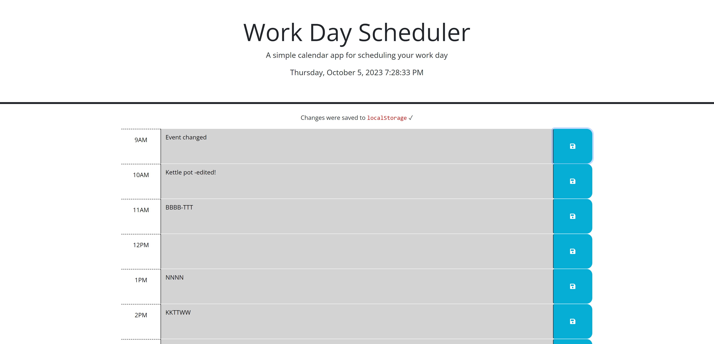
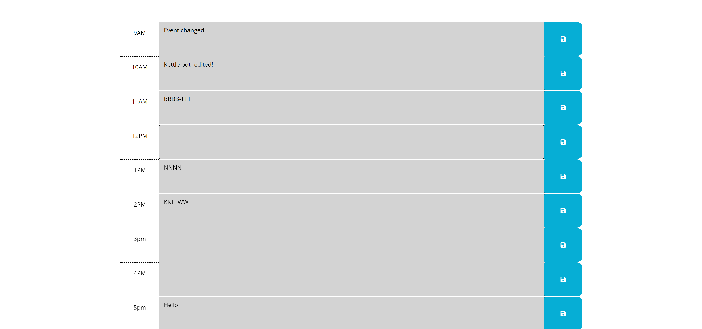

# Work Day Scheduler
This project was to create a simple day planner application that allows a user to save events for a day [9am to 5pm].

## Technology Used 

| Technology Used         | Resource URL           | 
| ------------- |-------------| 
| jQuery   | [https://jquery.com/](https://jquery.com/) | 
| HTML    | [https://developer.mozilla.org/en-US/docs/Web/HTML](https://developer.mozilla.org/en-US/docs/Web/HTML) | 
| CSS     | [https://developer.mozilla.org/en-US/docs/Web/CSS](https://developer.mozilla.org/en-US/docs/Web/CSS)      |   
| Git | [https://git-scm.com/](https://git-scm.com/)     |    
| Day.js | [https://day.js.org/](https://day.js.org/)     |   

## Description

A simple day planner application that allows a user to save events for the working hours of the day. Starter code was provided and our task was to update it to get the desired functionality.

User is able to see color coded time blocks that represent an hour of time and if it is the current, past or future time.

User is able to click on the text area and update the tasks for that hour of time and save it by using the save button. The changes are saved to the browsers localStorage and can persist users tasks.

When the application first loads it gets the tasks stored in the browsers localStorage and uses it to add content to the time blocks.

The following animation demonstrates the mock application functionality:

## Usage
When a user opens this application, they are able to see the current date and time and color coded time blocks for each of the hours from 9am to 5pm. Each hour of time is color coded to show if its the present, past or future time.

User can click on the text area and update the test for that hour. Clicking on the save button will save this to local storage and will persist even if the user refreshes the browser.

The application displays a message when anything is saved to localStorage. The message fades away after 5 seconds of being displayed.

## Learning points
Here are a few things that I learnt while working on this project.

Using external library like day.js to use time calculations and displaying time in different formats.
Using jQuery to access DOM nodes and manipulating their properties and setting time intervals and timers.

Using CSS for hiding and displaying text using opacity and transitions.
Saving and retreiving data from localStorage.

## Screenshots

## Author Info
Deepak Sinha

* [Portfolio](https://dee-here.github.io/portfolio/)
* [Github](https://github.com/dee-here)